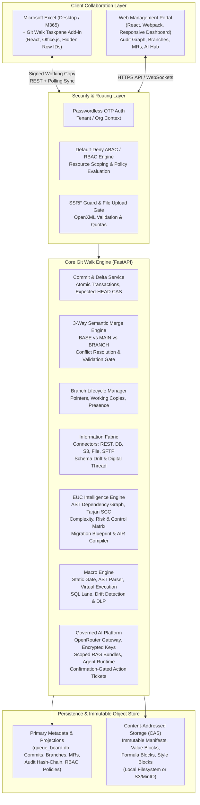

# Git Walk (Boardwalk Clone)

> **Enterprise Version Control, Governance, and Governed AI for Excel Spreadsheets**  
> *Git-style branches, cell-level atomic commits, 3-way semantic merge, immutable audit trails, End-User Computing (EUC) modernization, Enterprise Information Fabric, and policy-governed AI — backed by SQLite and Content-Addressed Storage.*

---

## Table of Contents

1. [Executive Summary & Core Philosophy](#1-executive-summary--core-philosophy)
2. [High-Level Architecture](#2-high-level-architecture)
3. [Deep-Dive Architecture & Core Capabilities](#3-deep-dive-architecture--core-capabilities)
   - [Pillar 1: Content-Addressed Storage (CAS) & Semantic Ledger](#pillar-1-content-addressed-storage-cas--semantic-ledger)
   - [Pillar 2: Entity Identity & Excel Working Tree](#pillar-2-entity-identity--excel-working-tree)
   - [Pillar 3: Concurrency, Personal Branches & 3-Way Semantic Merge](#pillar-3-concurrency-personal-branches--3-way-semantic-merge)
   - [Pillar 4: Enterprise Identity, Tenancy & Security (Stage 3.1)](#pillar-4-enterprise-identity-tenancy--security-stage-31)
   - [Pillar 5: Enterprise Information Fabric & Digital Thread (Stage 4)](#pillar-5-enterprise-information-fabric--digital-thread-stage-4)
   - [Pillar 6: End-User Computing (EUC) Governance & Modernization (Stage 2)](#pillar-6-end-user-computing-euc-governance--modernization-stage-2)
   - [Pillar 7: Governed AI Platform & Autonomous Agent System (Stage 5)](#pillar-7-governed-ai-platform--autonomous-agent-system-stage-5)
   - [Pillar 8: Macro Engine, Virtual Execution & Security](#pillar-8-macro-engine-virtual-execution--security)
4. [Repository Directory Structure](#4-repository-directory-structure)
5. [Getting Started & Local Development Setup](#5-getting-started--local-development-setup)
   - [Prerequisites](#prerequisites)
   - [1. Backend Setup & Configuration](#1-backend-setup--configuration)
   - [2. Frontend & Office Add-in Setup](#2-frontend--office-add-in-setup)
   - [3. Excel Working Tree Workflow](#3-excel-working-tree-workflow)
6. [Operational Utilities & Developer Reference](#6-operational-utilities--developer-reference)
   - [Direct Database Inspection (SQLite)](#direct-database-inspection-sqlite)
   - [Running Automated Tests](#running-automated-tests)
   - [Database Reset Utility](#database-reset-utility)
   - [Configuration & Environment Variables](#configuration--environment-variables)
7. [Comprehensive API Reference](#7-comprehensive-api-reference)

---

## 1. Executive Summary & Core Philosophy

### The Spreadsheet Dilemma
In modern enterprises, mission-critical business logic, financial models, risk assessments, and operational workflows reside inside Microsoft Excel workbooks. However, spreadsheets suffer from critical governance and collaboration bottlenecks:
- **No True Version Control:** Edits are shared via email chains (`Budget_v2_final_FINAL.xlsx`), leading to data overwrites and lost history.
- **Silent Breakages:** Moving rows, inserting columns, or overriding complex formulas with static values causes undetectable downstream cascading errors.
- **Lack of Access Control & Auditability:** Anyone with the file can alter formulas or historical figures without cryptographic proof of who changed what, when, and why.
- **EUC Operational Risk:** Organizations manage thousands of spreadsheets without visibility into complexity, circular dependencies, external links, or automation readiness.

### The Git Walk Solution
**Git Walk** transforms Excel workbooks into **fully governed repositories**:
- **Every Workbook is a Repository:** Complete with worksheets, commit history, branches, contributors, and governance policies.
- **Signed Working Copies:** Workbooks downloaded from Git Walk contain cryptographically signed tokens tying them to a specific repository, branch, and base version.
- **Local Working Tree:** Edits in Excel remain local until the user explicitly reviews a visual diff and commits an atomic, audited change set.
- **True 3-Way Merge & Protected Main:** Main branches are protected. Collaborators work in isolated personal branches and submit Merge Requests with automatic 3-way conflict detection (BASE vs. MAIN vs. BRANCH) and deterministic validation gates.
- **Immutable Audit Ledger:** Every cell change is recorded in a SHA-256 hash-chained ledger, preventing retroactive tampering.
- **Autonomous EUC Modernization:** Automatically extracts formula ASTs, builds dependency graphs, scores inherent/residual risk, creates migration blueprints, and generates production-ready full-stack software scaffolds (FastAPI + React + PostgreSQL).
- **Governed AI Copilot:** OpenRouter-powered reasoning grounded strictly in permission-trimmed repository evidence with prompt injection defenses and human confirmation gates.

---

## 2. High-Level Architecture



---

## 3. Deep-Dive Architecture & Core Capabilities

### Pillar 1: Content-Addressed Storage (CAS) & Semantic Ledger
At the foundation of Git Walk is a content-addressed storage engine (`semantic_object_v1`):
- **Object Model:** Every workbook state is defined by a SHA-256 root manifest. Root manifests reference worksheet manifests, which in turn point to compressed, immutable value blocks, formula blocks, style blocks, and comment blocks.
- **Copy-on-Write (CoW) & Deduplication:** When a commit alters 5 cells in a 100,000-row workbook, only the affected value block and manifest are written. All unchanged blocks are reused across commits and branches.
- **Deterministic Reconstruction (Hydration):** Any historical commit can be reconstructed deterministically from CAS.
- **Safe Garbage Collection (Mark-and-Sweep):** Storage reclamation traces all reachable objects from branch HEADs, commit histories, EUC analyses, and generated scaffolds. Active **Legal Holds** immediately halt any destructive collection.
- **Transactional Outbox:** Every semantic commit records a `COMMIT_CREATED` event inside the metadata transaction, ensuring guaranteed delivery to downstream event listeners.

### Pillar 2: Entity Identity & Excel Working Tree
Excel does not inherently assign identities to rows or columns; inserting a row shifts all cell addresses below it. Git Walk solves this with stable logical identities:
- **Hidden Row Identity (`__GITWALK_ROW_ID`):** During workbook provisioning, a hidden column containing a unique GUID is injected into every worksheet. When rows are inserted, deleted, or sorted, Git Walk continues to track the semantic row entity rather than an unstable Excel coordinate.
- **Server-Managed Sheet & Column Identifiers:** Sheets and columns are tracked via permanent identifiers (`SHEET_*`, `COL_*`), allowing renames and moves without breaking lineage.
- **Signed Working Copies:** Generated workbooks embed an OpenXML custom property packet containing signed working copy metadata. The server validates that commits originate from the designated user, branch, and base version.
- **Local Review & Atomic Commit:** Edits made in Excel are isolated in the user's local working tree. The **Review Changes** panel computes the diff against the checked-out base version. Submitting a commit writes an atomic, multi-operation change set (up to 10,000 operations per commit) to the personal branch.

### Pillar 3: Concurrency, Personal Branches & 3-Way Semantic Merge
Git Walk implements true trunk-based software development workflows for spreadsheets:
- **Lightweight Branches:** Branches are zero-cost pointers to immutable root manifests. Creating a personal branch creates no redundant data copies.
- **Compare-and-Swap Concurrency Control:** Every commit includes `expected_head_commit_id`. If another commit has updated the branch HEAD concurrently, the commit is rejected with `409 BRANCH_HEAD_CHANGED`, requiring a pull/rebase.
- **Pull & Automatic 3-Way Rebase:** When pulling changes from the server, Git Walk compares the local working copy, the base version, and the new server HEAD. Non-overlapping cell and structure updates are cleanly reapplied to Excel automatically.
- **Protected Main & Merge Requests:** Direct commits to `main` can be restricted by branch protection rules. Collaborators submit a Merge Request (MR) containing:
  - Divergence metrics (ahead/behind counts).
  - 3-way semantic diff between BASE, MAIN, and BRANCH.
  - Interactive conflict register for overlapping cell, formula, row, column, or sheet changes.
  - Automated deterministic workbook validation gates (structural integrity, type consistency, duplicate keys, broken references, row-count anomalies).
- **Merge Execution:** Once approved by the repository owner, the merge engine generates a two-parent commit on `main`, transitions the source branch to `MERGED`, and revokes active working copies with `409 WORKING_COPY_CLOSED`.
- **Non-Destructive Reverts:** Rolling back an erroneous commit creates a new forward inverse commit (`REVERTS_COMMIT_ID`), preserving complete historical truth.

### Pillar 4: Enterprise Identity, Tenancy & Security (Stage 3.1)
Enterprise compliance and data isolation are enforced centrally:
- **Tenant & Organization Isolation:** Every repository, branch, and integration belongs to an organization. Cross-tenant access is strictly rejected.
- **Default-Deny ABAC/RBAC Engine (`AuthorizationEngine`):** Centralized authorization engine evaluating requests against:
  1. Organization and tenant verification.
  2. Scoped explicit DENY policies (takes highest precedence).
  3. Scoped role assignments (`ORG_ADMIN`, `REPOSITORY_OWNER`, `EDITOR`, `VIEWER`) and security group inheritance.
  4. Scoped explicit ALLOW policies with attribute-based conditions (`eq`, `ne`, `in`, `contains`, `gte`, `lte`).
- **Cryptographic Service Accounts:** Automations and integrations authenticate via service accounts whose secrets are shown once upon creation and stored exclusively as cryptographic hashes.
- **Immediate Session Revocation:** Suspending a compromised user invalidates all active tokens, web sessions, and Excel working copies in real time.
- **Append-Only Hash-Chained Audit Ledger (`AUDIT_EVENTS`):** Each administrative and version-control event is cryptographically linked to the preceding event via SHA-256 hash chaining. Database triggers prevent in-place modification or deletion.

### Pillar 5: Enterprise Information Fabric & Digital Thread (Stage 4)
Spreadsheets do not live in isolation; they integrate with enterprise systems:
- **Provider-Neutral Connector Registry:** Built-in connection managers for:
  - **Relational Databases:** PostgreSQL, MySQL, SQLite via SQLAlchemy.
  - **REST APIs:** Configurable HTTP methods, bearer/basic auth, pagination, and header templates.
  - **Object Storage:** S3, MinIO, and Cloudflare R2.
  - **Files & SFTP:** Host-key-pinned SFTP and local/network file storage.
- **SSRF Defense Guard:** All outbound HTTP/integration requests pass through strict IP validation rejecting private, loopback, link-local, and reserved IPv4/IPv6 ranges to protect internal networks.
- **Schema Discovery & Drift Detection:** Connectors discover remote schemas, compare them against versioned canonical schemas, and flag structural drift.
- **Data Quality & Quarantine:** Incoming records undergo schema and business-rule validation. Invalid records are placed into an isolated **Quarantine** store for remediation rather than contaminating downstream systems.
- **Enterprise Digital Thread:** Generates a temporal, cross-system dependency graph connecting source systems, raw payloads in CAS, canonical transformed entities, ingestion runs, and audit records.
- **Fault-Tolerant Operations:** Built-in incremental checkpoints, transient retry logic with exponential backoff, dead-letter queues, and automated incident ticketing.

### Pillar 6: End-User Computing (EUC) Governance & Modernization (Stage 2)
Git Walk provides an end-to-end modernization pipeline for End-User Computing (EUC) applications:
- **Stage 2.1 — Structural Inventory:** Deep OpenXML inspection analyzing formula patterns, tables, named ranges, data validations, conditional formats, pivots, charts, external connections, Power Query queries, and static VBA indicators without running untrusted code.
- **Stage 2.2 — AST Formula & Dependency Intelligence:**
  - Excel-aware tokenizer and Abstract Syntax Tree (AST) parser.
  - Directed Acyclic Graph (DAG) construction mapping `formula cell DEPENDS_ON precedent`.
  - Resolves cell coordinates, bounded/unbounded ranges, structured table references, cross-sheet links, and external file paths.
  - Cycle detection using Tarjan's Strongly Connected Components (SCC) algorithm.
  - Cell-level blast radius and downstream impact analysis.
- **Stage 2.3 — Explainable Complexity, Risk & Control Matrix:**
  - Separates **Inherent Risk**, **Control Strength**, and **Residual Risk** using configurable scoring profiles (Financial Model, Regulatory, Operational).
  - Findings engine identifying circular references, broken formulas (`#REF!`, `#VALUE!`), hardcoded constants overriding formulas, unprotected critical formulas, and external dependencies.
  - Findings lifecycle management (acknowledged, accepted risk with expiry, resolved, false-positive suppression).
- **Stage 2.4 — Migration Blueprint:**
  - Evaluates migration readiness across 8 distinct dimensions.
  - Categorizes workbook components into modernization modes: `AUTO_MIGRATABLE`, `ASSISTED_MIGRATION`, `MANUAL_REENGINEERING`, `RETAIN_IN_EXCEL`, or `RETIRE`.
  - Recommends target strategies (Lift & Govern, Hybrid Modernization, Native Rebuild, Decomposition).
  - Generates delivery waves, effort classes (XS through XXL), technology mappings, and validation plans.
- **Stage 2.5 — Native Application Model (AIR) & Code Generator:**
  - Technology-neutral **Application Intermediate Representation (AIR)** modeling entities, fields, relationships, business rules, workflows, APIs, UI screens, roles, and automated tests.
  - Human Review Station: Inferred relationships and workflows require explicit confirmation before compilation.
  - Full-Stack Code Scaffold Generator: Deterministically emits production-ready code:
    - **Backend:** FastAPI + Python with typed Pydantic schemas and SQLAlchemy models.
    - **Frontend:** React + TypeScript application with interactive data tables and forms.
    - **Database:** PostgreSQL migrations and seeds.
    - **Tests & Parity:** Automated unit and regression test suite verifying parity with original Excel calculations.
- **Continuous Assurance & Attestation:** Tracks continuous compliance health scores, recurring control attestations, and compliance drift.

### Pillar 7: Governed AI Platform & Autonomous Agent System (Stage 5)
Git Walk provides governed generative and analytical AI capabilities:
- **Unified OpenRouter Gateway:** Multi-model routing supporting Claude, GPT-4, Llama, and specialized reasoning models.
- **Encrypted Per-User Credentials:** Users can configure their personal OpenRouter API key; keys are encrypted at rest using AES-256 before storage.
- **Permission-Scoped Evidence RAG:** AI never accesses the database or filesystem directly. Answers are grounded in structured evidence bundles filtered through the requesting user's active RBAC permissions.
- **Prompt Injection Resilience:** Evidence and cell values are tagged as untrusted context; injection heuristics detect and neutralize malicious instructions embedded in spreadsheet data.
- **Autonomous Specialized Agents:**
  - **Discovery Agent:** Identifies hidden data models, implicit relationships, and business domains across workbooks.
  - **Insights Agent & Query Engine:** Natural-language queries over dataset records, audit trails, and version graphs.
  - **Formula Explainer:** Plain-English decomposition of complex nested formulas and calculation paths.
  - **Finding Remediation Agent:** Generates actionable guidance for fixing broken dependencies and formula overrides.
  - **Portfolio Compliance Copilot:** Summarizes compliance health and audit risks across organizational workbooks.
  - **Team Signals & Expertise Matcher:** Analyzes edit patterns to recommend qualified reviewers for merge requests.
- **Confirmation-Gated Action Tickets:** High-risk AI actions (e.g., executing an integration sync or replaying dead letters) are created as expiring action tickets. They execute **only** when an authorized user explicitly confirms the action.
- **Safety Evaluation Harness:** Continuous evaluation harness testing accuracy, grounding, and prompt-injection resistance against a golden dataset.

### Pillar 8: Macro Engine, Virtual Execution & Security
VBA macros are a primary source of operational and security risk. Git Walk provides comprehensive macro governance:
- **Macro AST Parser & Tokenizer:** Parses VBA source code into structured syntax trees without running macro code.
- **Static Gate & Security Scanner:** Inspects macro routines for dangerous API calls, network sockets, shell execution, filesystem mutations, and obfuscated strings.
- **Sandboxed Macro Interpreter:** Safe execution engine for supported macro recipes within controlled virtual environments.
- **Virtual Workbook Execution & SQL Lane:** Translates macro business rules and transformations into virtual workbook state or direct SQL analytical queries.
- **Drift Detection:** Compares macro source code against executed behavior to flag unapproved macro modifications.
- **Clipboard DLP & Macro Sanitization:** OpenXML injection service embedding Data Loss Prevention (DLP) controls into workbooks to prevent unauthorized data copying.

---

## 4. Repository Directory Structure

```
c:\Projects\boardwalk-clone\
├── README.md                           # Master project guide (root copy)
├── queue_board.db                      # Root backup / scratch SQLite file
└── excel-sqlite-sync/                  # Primary Git Walk application repository
    ├── README.md                       # Canonical Master Documentation (this file)
    ├── docker-compose.yml              # Multi-container orchestration (API, MinIO, Postgres, Redis)
    ├── .env.example                    # Sample environment configuration template
    ├── .gitignore                      # Git ignore rules
    │
    ├── backend/                        # FastAPI Backend Service
    │   ├── queue_board.db              # Canonical active SQLite database
    │   ├── requirements.txt            # Python dependencies (FastAPI, SQLAlchemy, openpyxl, etc.)
    │   ├── configure.ps1               # Interactive secure configuration script
    │   ├── reset_database.py           # Canonical schema reinitialization utility
    │   ├── test_integration.py         # End-to-end integration test runner
    │   ├── Dockerfile                  # Production container definition
    │   │
    │   ├── app/                        # Application source code
    │   │   ├── main.py                 # FastAPI application factory, middleware, core sync routes
    │   │   ├── config.py               # Settings management (Pydantic-based env parsing)
    │   │   ├── database.py             # SQLite/PostgreSQL connection engine & transaction management
    │   │   ├── security.py             # Session tokens, OTP hashing, passwordless auth
    │   │   ├── openxml_injector.py     # Injects signed working copy identity & taskpane into Excel
    │   │   ├── observability.py        # Structured logging, metrics, request tracing
    │   │   │
    │   │   ├── access_control/         # Stage 3.1 Enterprise ABAC/RBAC engine
    │   │   │   ├── engine.py           # Default-deny authorization decision point
    │   │   │   ├── service.py          # Organization, group, role, and policy management
    │   │   │   └── bootstrap.py        # Default roles and system permission bootstrap
    │   │   │
    │   │   ├── ai/                     # Stage 5 Governed AI Platform & Autonomous Agents
    │   │   │   ├── gateway.py          # OpenRouter client, token counters, encrypted key resolver
    │   │   │   ├── evidence.py         # Permission-scoped RAG context builder & injection guard
    │   │   │   ├── agent_runtime.py    # Autonomous agent orchestration runtime
    │   │   │   ├── discovery_agent.py  # Dataset relationship & structure discovery agent
    │   │   │   ├── insights_agent.py   # Dataset & governance Q&A agent
    │   │   │   ├── formula_explainer.py# AST-based formula explanation engine
    │   │   │   └── signal_engine.py    # Team activity, reviewer matching & expertise signals
    │   │   │
    │   │   ├── api/                    # Modular API route controllers
    │   │   │   ├── administration.py   # Organization admin, service accounts, audit review
    │   │   │   ├── ai_platform.py      # AI chat, agents, policies, evaluations, usage metrics
    │   │   │   ├── commits.py          # Commit graph, diff inspection, cell blame & history
    │   │   │   ├── euc.py              # EUC inventory, dependency graph, risk, AIR & code gen
    │   │   │   ├── integrations.py     # Information Fabric connections, discovery & pipelines
    │   │   │   ├── macros.py           # Macro analysis, execution, recipes & drift detection
    │   │   │   ├── merge_requests.py   # MR lifecycle, 3-way conflict resolution & approvals
    │   │   │   └── repositories.py     # Repositories, branches, categories & downloads
    │   │   │
    │   │   ├── euc/                    # End-User Computing Intelligence Engine
    │   │   │   ├── analyzers.py        # Static OpenXML inspection & feature extraction
    │   │   │   ├── dependency/         # AST formula parser, cell DAG, Tarjan cycle detector
    │   │   │   ├── intelligence/       # Inherent/residual risk, complexity & findings engine
    │   │   │   ├── migration/          # Modernization blueprint, blockers, effort & waves
    │   │   │   ├── application_model/  # Stage 2.5 AIR compiler & code generation engine
    │   │   │   ├── continuous_assurance.py # Continuous compliance scoring
    │   │   │   └── attestation.py      # Periodic control attestation workflows
    │   │   │
    │   │   ├── integrations/           # Stage 4 Enterprise Information Fabric
    │   │   │   ├── connectors/         # REST, SQLAlchemy DB, S3, File, SFTP connectors
    │   │   │   └── ssrf_guard.py       # SSRF network defense & IP validator
    │   │   │
    │   │   ├── macros/                 # Macro Governance Engine
    │   │   │   ├── parser/             # VBA tokenizer and AST statement parser
    │   │   │   ├── interpreter.py      # Sandboxed macro recipe interpreter
    │   │   │   ├── virtual_workbook.py # Virtual workbook execution state
    │   │   │   ├── sql_lane.py         # Macro logic translation to SQL
    │   │   │   └── static_gate.py      # Static macro risk gate
    │   │   │
    │   │   ├── storage/                # Content-Addressed Storage (CAS)
    │   │   │   ├── cas.py              # SHA-256 block storage (local filesystem or S3/MinIO)
    │   │   │   ├── manifests.py        # Root and worksheet manifest serializers
    │   │   │   └── gc.py               # Safe mark-and-sweep garbage collection with legal hold
    │   │   │
    │   │   └── services/               # Core business services
    │   │       ├── merge_service.py    # 3-way merge engine & conflict calculator
    │   │       ├── workbook_service.py # OpenXML parsing, generation & projection builder
    │   │       └── branch_lifecycle_manager.py # Branch creation, sync & revocation
    │   │
    │   ├── tests/                      # Comprehensive automated test suites
    │   │   ├── test_stage2_version_engine.py # Versioning, diffs, commits & CAS
    │   │   ├── test_stage31_enterprise_security.py # ABAC, tenancy, roles & session revoke
    │   │   ├── test_stage4_governance.py    # Information fabric & audit ledger
    │   │   ├── test_macro_interpreter.py    # Macro AST parsing and execution
    │   │   └── test_discovery_agent.py      # AI discovery and signal tests
    │   │
    │   └── object_store/               # Local CAS immutable blocks (prefix/hash)
    │
    ├── frontend/                       # React Web Portal & Excel Taskpane Add-in
    │   ├── package.json                # Dependencies (React 18, Office.js, Lucide icons, etc.)
    │   ├── webpack.config.js           # Multi-target build (Web Portal + HTTPS Office Add-in)
    │   ├── public/                     # Static assets & Office Add-in manifest.xml
    │   └── src/
    │       ├── index.jsx               # React entry point
    │       ├── App.jsx                 # Primary routing, workspace selector, navigation
    │       ├── styles.css              # Modern responsive design system
    │       ├── components/
    │       │   ├── TaskpaneUI.jsx      # Excel Taskpane Add-in UI (diff, commit, pull/rebase)
    │       │   ├── AICommandCenter.jsx # Governed AI chat, evidence explorer & agent runs
    │       │   ├── CommitGraphView.jsx # Visual branch commit DAG
    │       │   ├── AuditGraphView.jsx  # Hash-chained immutable audit event inspector
    │       │   ├── TeamActivityPanel.jsx # Real-time collaborator presence & activity matrix
    │       │   ├── RepositoryAccessTree.jsx # Visual RBAC access tree
    │       │   ├── SignalsWorkspace.jsx# Team signals & reviewer match recommendations
    │       │   └── VirtualRunPanel.jsx # Virtual macro execution control panel
    │       └── services/
    │           └── api.js              # Centralized Axios API client with auth interceptors
    │
    └── zdocs/                          # Visual Presentation Materials
        ├── PRESENTATION_FLOWCHARTS.md          # 25 Complete Mermaid system flowcharts
        └── PRESENTATION_SIMPLE_EXPLANATIONS.md # Plain-English presentation speaking notes
```

---

## 5. Getting Started & Local Development Setup

### Prerequisites
- **Python:** Version 3.10, 3.11, or 3.12 (`python --version` or `py --version`).
- **Node.js:** Version 18.x or 20.x LTS (`node --version`).
- **npm:** Version 9.x or 10.x (`npm --version`).
- **Microsoft Excel:** Desktop Excel on Windows/macOS or Microsoft 365 on the web.
- **PowerShell:** PowerShell 5.1 or PowerShell 7 (on Windows).

---

### 1. Backend Setup & Configuration

1. **Navigate to the backend directory:**
   ```powershell
   cd C:\Projects\boardwalk-clone\excel-sqlite-sync\backend
   ```

2. **Run the interactive configuration wizard:**
   ```powershell
   powershell -ExecutionPolicy Bypass -File .\configure.ps1
   ```
   *Note: Secrets are masked during entry and saved to the gitignored `backend/.env`. If running in development without SMTP, an authentication secret is automatically created in `backend/.auth-secret`, and one-time login OTP codes are displayed directly on the login screen.*

3. **Install Python dependencies:**
   ```powershell
   py -m pip install -r requirements.txt
   ```

4. **Start the FastAPI backend server:**
   ```powershell
   py -m uvicorn app.main:app --reload --port 8000
   ```
   - **API Base URL:** `http://localhost:8000`
   - **Interactive OpenAPI Documentation:** `http://localhost:8000/docs`
   - **Health Check Endpoint:** `http://localhost:8000/health`

---

### 2. Frontend & Office Add-in Setup

1. **Open a new terminal and navigate to the frontend directory:**
   ```powershell
   cd C:\Projects\boardwalk-clone\excel-sqlite-sync\frontend
   ```

2. **Install frontend packages:**
   ```powershell
   npm install
   ```

3. **Start the Webpack development server with Add-in registration:**
   ```powershell
   npm.cmd start
   ```
   *Note: `npm start` automatically uses Microsoft's Office Add-in development utility to register `public/manifest.xml` locally and provisions a trusted local HTTPS certificate. No temporary debug workbook is created; no manual trusted catalog configuration is required.*

4. **Access the Web Portal:**
   - Open your browser to `https://localhost:3000`.
   - Sign in using your email address. (In development mode, enter the OTP displayed on the screen).

---

### 3. Excel Working Tree Workflow

1. **Create or Open a Repository in the Web Portal:**
   - From `https://localhost:3000`, click **Upload & Provision Workbook** or choose an existing repository.
   - Click **Create personal branch and download workbook** (or **Open branch in Excel**).
2. **Open the Downloaded Workbook in Excel:**
   - The downloaded workbook contains a cryptographically signed identity packet.
   - The Git Walk taskpane opens automatically in Excel (or can be launched from the Excel Ribbon tab).
   - Sign in on the taskpane once using your email. The taskpane identifies the embedded repository and branch ID and connects securely.
3. **Collaborate with Git-Style Control:**
   - **Edit:** Edit cells, formulas, or rows freely in Excel. Edits stay completely local.
   - **Review Changes:** Click **Review changes** in the taskpane to view a visual diff showing every modified cell, updated formula, or added row.
   - **Commit:** Enter a commit message and click **Commit changes**. An atomic commit is submitted to your personal branch.
   - **Pull / Sync:** If others have worked on your branch or if `main` has progressed, click **Pull latest**. Non-conflicting edits are rebased onto your spreadsheet automatically.
   - **Merge Request:** When your work is complete, submit a Merge Request from the Web Portal for the repository owner to review, validate, and merge into protected `main`.

---

## 6. Operational Utilities & Developer Reference

### Direct Database Inspection (SQLite)

> [!IMPORTANT]
> Always query the active database located at `backend/queue_board.db`. Do not query the root `boardwalk-clone/queue_board.db`, which is an external backup.

```powershell
cd C:\Projects\boardwalk-clone\excel-sqlite-sync\backend
py -m sqlite3 queue_board.db
```

Useful SQLite inspection queries:
```sql
-- View all application tables
.tables

-- Inspect recent version-control commits
SELECT COMMIT_ID, BRANCH_ID, AUTHOR_EMAIL, MESSAGE, CHANGE_COUNT, CREATED_AT
FROM COMMITS
ORDER BY CREATED_AT DESC LIMIT 10;

-- Inspect detailed cell-level changes for a commit
SELECT OPERATION_TYPE, SHEET_ID, ROW_ID, COLUMN_ID, OLD_VALUE, NEW_VALUE, OLD_FORMULA, NEW_FORMULA
FROM COMMIT_CHANGES
WHERE COMMIT_ID = 'CMT_YOUR_COMMIT_ID';

-- Verify the tamper-evident audit ledger
SELECT EVENT_ID, EVENT_TYPE, ACTOR_EMAIL, RESOURCE_ID, PREVIOUS_EVENT_HASH, EVENT_HASH, CREATED_AT
FROM AUDIT_EVENTS
ORDER BY ROWID DESC LIMIT 10;

-- Inspect active merge requests and their status
SELECT MR_ID, SOURCE_BRANCH_ID, TARGET_BRANCH_ID, TITLE, STATUS, VALIDATION_STATUS, CREATED_AT
FROM MERGE_REQUESTS;
```

---

### Running Automated Tests

Run the full backend test suite to verify code quality, security rules, and algorithm invariants:

```powershell
cd C:\Projects\boardwalk-clone\excel-sqlite-sync\backend

# Run the complete test suite
py -m pytest tests -q

# Run specific functional test suites
py -m pytest tests/test_stage2_version_engine.py -v
py -m pytest tests/test_stage31_enterprise_security.py -v
py -m pytest tests/test_stage4_governance.py -v
py -m pytest tests/test_discovery_agent.py -v
py -m pytest tests/test_macro_interpreter.py -v
```

To validate the frontend build:
```powershell
cd C:\Projects\boardwalk-clone\excel-sqlite-sync\frontend
npm.cmd run build
```

---

### Database Reset Utility

To completely reset local development state (clearing all repositories, commits, branches, users, and audit records, and rebuilding a clean schema):

```powershell
cd C:\Projects\boardwalk-clone\excel-sqlite-sync\backend
py reset_database.py --yes
```

---

### Configuration & Environment Variables

Key settings managed in `backend/.env`:

| Variable | Default Value | Description |
|---|---|---|
| `APP_ENV` | `development` | Environment mode (`development` or `production`). |
| `APP_URL` | `https://localhost:3000` | Web management portal URL. |
| `API_BASE_URL` | `http://localhost:8000` | FastAPI server base address. |
| `DATABASE_URL` | `sqlite:///queue_board.db` | Database connection string (SQLite or PostgreSQL). |
| `CORS_ORIGINS` | `https://localhost:3000,...` | Allowed CORS origins. |
| `SMTP_HOST`, `SMTP_PORT` | `smtp.gmail.com`, `587` | Outbound email settings for passwordless OTP delivery. |
| `SMTP_USERNAME`, `SMTP_PASSWORD` | *(empty in dev)* | SMTP credentials (use Google App Passwords for Gmail). |
| `OPENROUTER_API_KEY` | *(optional)* | Global OpenRouter fallback key for the AI platform. |
| `OPENROUTER_MODEL` | `nvidia/nemotron-4-340b-instruct:free` | Default AI model used by copilot agents. |
| `OBJECT_STORE_BACKEND` | `filesystem` | Storage backend for CAS (`filesystem` or `s3`). |
| `OBJECT_STORE_PATH` | `./object_store` | Filesystem path for local CAS blocks. |
| `TEMP_FILE_MAX_AGE_HOURS` | `24` | Automated cleanup threshold for temporary Excel upload files. |

---

## 7. Comprehensive API Reference

Git Walk provides a comprehensive, documented REST API under the `/api/v1` namespace.

### Authentication & Sessions
| Method | Route | Description |
|---|---|---|
| `POST` | `/api/v1/auth/request-code` | Request a passwordless login OTP sent via email (or displayed on dev screen). |
| `POST` | `/api/v1/auth/verify-code` | Verify the OTP and establish an authenticated session. |
| `GET` | `/api/v1/auth/session` | Retrieve the authenticated user's profile, roles, and permissions. |
| `POST` | `/api/v1/auth/logout` | Invalidate current user session. |

### Repositories, Workbooks & Downloads
| Method | Route | Description |
|---|---|---|
| `POST` | `/api/v1/upload-and-provision` | Upload an `.xlsx` workbook, initialize a repository, and download a configured workbook. |
| `GET` | `/api/v1/categories` | Retrieve the hierarchical category navigation tree. |
| `GET` | `/api/v1/repositories/name-availability` | Check if a repository title or slug is available. |
| `GET` | `/api/v1/repositories/{table_id}/overview` | Overview of repository health, default branch HEAD, risk, and validation state. |
| `GET` | `/api/v1/repositories/{table_id}/branches/{branch_id}/download` | Download a complete multi-sheet `.xlsx` workbook with signed working copy tokens. |
| `GET` | `/api/v1/repositories/{table_id}/branches/{branch_id}/sheets/{sheet_id}/records` | Paginated records for a specific sheet. |
| `DELETE` | `/api/v1/repositories/{table_id}` | Permanent repository deletion pipeline (export, audit notice, hard delete). |

### Personal Branches & Working Copies
| Method | Route | Description |
|---|---|---|
| `POST` | `/api/v1/repositories/{table_id}/branches` | Create a new pointer-only personal branch from a base commit. |
| `GET` | `/api/v1/branches/{branch_id}/state` | Reconstruct the complete workbook projection at branch HEAD or a specified commit. |
| `GET` | `/api/v1/branches/{branch_id}/commits` | Retrieve the commit DAG for the branch. |
| `GET` | `/api/v1/branches/{branch_id}/divergence` | Ahead/behind commit metrics and merge-base calculation relative to `main`. |
| `POST` | `/api/v1/branches/{branch_id}/sync` | Perform a 3-way rebase sync of protected `main` into a personal branch. |
| `DELETE` | `/api/v1/branches/{branch_id}` | Delete a branch and immediately revoke all issued working copies. |

### Semantic Commits & Attribution
| Method | Route | Description |
|---|---|---|
| `POST` | `/api/v1/workbook-commit` | Submit an atomic semantic commit with `expected_head_commit_id` CAS protection. |
| `GET` | `/api/v1/commits/{commit_id}` | Retrieve commit details, parent references, author, and semantic changes. |
| `POST` | `/api/v1/commits/{commit_id}/revert` | Create a safe forward inverse commit reversing an earlier commit. |
| `GET` | `/api/v1/branches/{branch_id}/blame` | Blame/attribution view mapping every current cell to author, commit, and date. |
| `GET` | `/api/v1/branches/{branch_id}/cells/{sheet_id}/{row_id}/{column_id}/history` | Retrieve the full historical mutation timeline of a stable cell entity. |

### Merge Requests & Governance Gates
| Method | Route | Description |
|---|---|---|
| `POST` | `/api/v1/merge-requests` | Open a semantic Merge Request proposing changes from a branch to `main`. |
| `GET` | `/api/v1/repositories/{table_id}/merge-requests` | List all open and historical Merge Requests for a repository. |
| `GET` | `/api/v1/merge-requests/{mr_id}` | Inspect MR diffs, 3-way conflicts, deterministic validation gates, and approvals. |
| `POST` | `/api/v1/merge-requests/{mr_id}/conflicts/{conflict_id}/resolve` | Resolve a typed conflict by selecting MAIN, BRANCH, or a custom value. |
| `POST` | `/api/v1/merge-requests/{mr_id}/review` | Submit an owner approval or rejection decision. |
| `POST` | `/api/v1/merge-requests/{mr_id}/merge` | Execute the merge, creating a two-parent commit on `main` and closing working copies. |

### Enterprise Access Control & Administration (Stage 3.1)
| Method | Route | Description |
|---|---|---|
| `GET` | `/api/v1/admin/members` | List organization users, status, and role assignments. |
| `POST` | `/api/v1/admin/members/provision` | Provision a new organizational user with designated roles. |
| `POST` | `/api/v1/admin/members/{user_id}/suspend` | Suspend a user and revoke all active sessions immediately. |
| `GET` | `/api/v1/admin/service-accounts` | List configured automated service accounts. |
| `POST` | `/api/v1/admin/service-accounts` | Create a service account (returns a one-time secret hash). |
| `GET` | `/api/v1/admin/policies` | Retrieve active ABAC attribute and security policies. |
| `POST` | `/api/v1/admin/branch-protection` | Configure branch protection rules (required approvals, validation gates). |

### End-User Computing (EUC) Intelligence & Modernization (Stage 2)
| Method | Route | Description |
|---|---|---|
| `POST` | `/api/v1/euc` | Register a workbook or CSV artifact as a governed EUC asset. |
| `POST` | `/api/v1/euc/{euc_id}/analysis` | Trigger a Stage 2.1 structural inventory analysis. |
| `POST` | `/api/v1/euc/{euc_id}/dependency/analysis` | Build a Stage 2.2 formula AST dependency graph (`DEPENDS_ON` DAG). |
| `GET` | `/api/v1/euc/{euc_id}/dependency/lineage/{sheet_id}/{cell_ref}` | Compute upstream precedents and downstream blast radius for a cell. |
| `POST` | `/api/v1/euc/{euc_id}/intelligence/analysis` | Run Stage 2.3 complexity, inherent/residual risk, and finding detectors. |
| `GET` | `/api/v1/euc/{euc_id}/findings` | Search and filter evidence-backed workbook findings. |
| `POST` | `/api/v1/euc/{euc_id}/migration/analyze` | Generate a Stage 2.4 modernization blueprint and delivery plan. |
| `GET` | `/api/v1/euc/{euc_id}/migration` | Retrieve modernization readiness scores, blockers, and target architecture. |
| `POST` | `/api/v1/euc/{euc_id}/application-model` | Compile Stage 2.5 technology-neutral Application Intermediate Representation (AIR). |
| `POST` | `/api/v1/euc/{euc_id}/application-model/approve` | Repository owner sign-off on confirmed AIR model components. |
| `POST` | `/api/v1/euc/{euc_id}/application-model/generate` | Generate a full-stack code scaffold (FastAPI + React + PostgreSQL). |
| `GET` | `/api/v1/euc/{euc_id}/application-model/generation/{run_id}/download` | Download the generated application ZIP bundle from CAS. |

### Enterprise Information Fabric (Stage 4)
| Method | Route | Description |
|---|---|---|
| `GET` | `/api/v1/integrations/connections` | List enterprise connectors (REST, DB, S3, File, SFTP). |
| `POST` | `/api/v1/integrations/connections` | Register an encrypted enterprise data connection. |
| `POST` | `/api/v1/integrations/connections/{conn_id}/test` | Test connection viability with SSRF safety checks. |
| `POST` | `/api/v1/integrations/connections/{conn_id}/discover` | Discover remote schemas and identify structural drift. |
| `POST` | `/api/v1/integrations/pipelines/run` | Execute an ingestion pipeline with checkpointing and quarantine handling. |
| `GET` | `/api/v1/integrations/digital-thread/{entity_id}` | Trace the cross-system digital thread and temporal lineage of an entity. |

### Governed AI Platform & Autonomous Agents (Stage 5)
| Method | Route | Description |
|---|---|---|
| `GET` | `/api/v1/ai/models` | List available OpenRouter models and connection health. |
| `POST` | `/api/v1/ai/config` | Save an encrypted user-level OpenRouter API key. |
| `POST` | `/api/v1/ai-platform/chat` | Send a prompt to the governed copilot with permission-trimmed evidence grounding. |
| `POST` | `/api/v1/ai-platform/agents/run` | Launch a bounded autonomous agent (Discovery, Insights, Remediation). |
| `GET` | `/api/v1/ai-platform/agents/runs` | Retrieve the agent execution ledger and trace history. |
| `POST` | `/api/v1/ai-platform/actions/{action_id}/confirm` | Confirm and execute an authorized, expiring high-risk AI action ticket. |
| `GET` | `/api/v1/ai-platform/usage` | Inspect token usage, cache hit rates, latency, and quota ledgers. |
| `POST` | `/api/v1/ai-platform/evaluations/run` | Run safety and injection evaluations against the golden benchmark dataset. |

### Macro Governance & Virtual Execution
| Method | Route | Description |
|---|---|---|
| `POST` | `/api/v1/macros/extract` | Extract and parse VBA code from `.xlsm` workbooks into AST structures. |
| `POST` | `/api/v1/macros/gate/evaluate` | Evaluate macro safety against the static risk gate. |
| `POST` | `/api/v1/macros/run/interpret` | Execute supported macro recipes in a safe, sandboxed interpreter. |
| `POST` | `/api/v1/macros/virtual/execute` | Run macro logic in a virtual workbook projection without launching Excel. |
| `GET` | `/api/v1/macros/drift/{macro_id}` | Detect behavioral or source code drift between macro runs. |

### Audit, Metrics & System Health
| Method | Route | Description |
|---|---|---|
| `GET` | `/api/v1/audit/events` | Inspect immutable audit ledger events with SHA-256 hash-chain verification. |
| `GET` | `/api/v1/observability/metrics` | Real-time system latency, commit throughput, and error metrics. |
| `GET` | `/api/v1/security/posture` | Effective security posture, active policies, and workbook limits. |
| `GET` | `/health` | Application health and database connectivity probe. |

---

## License & Attribution

Git Walk is proprietary enterprise software. Built with modern open standards including FastAPI, React, SQLite, SQLAlchemy, Office.js, and OpenXML.
